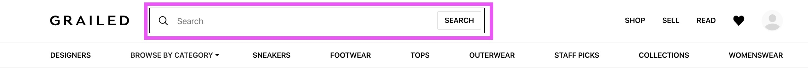
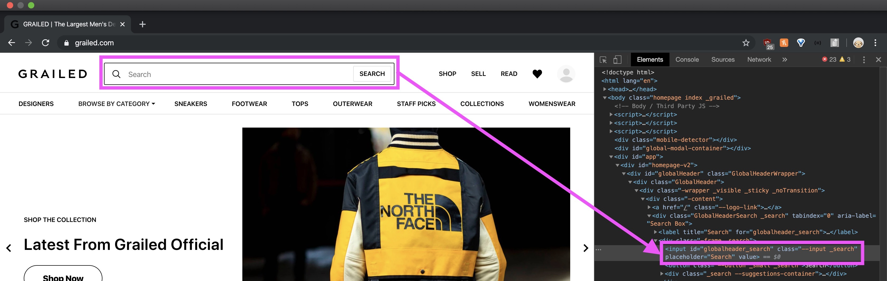
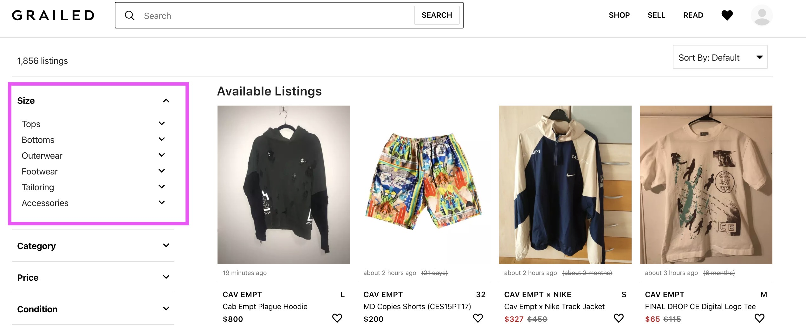
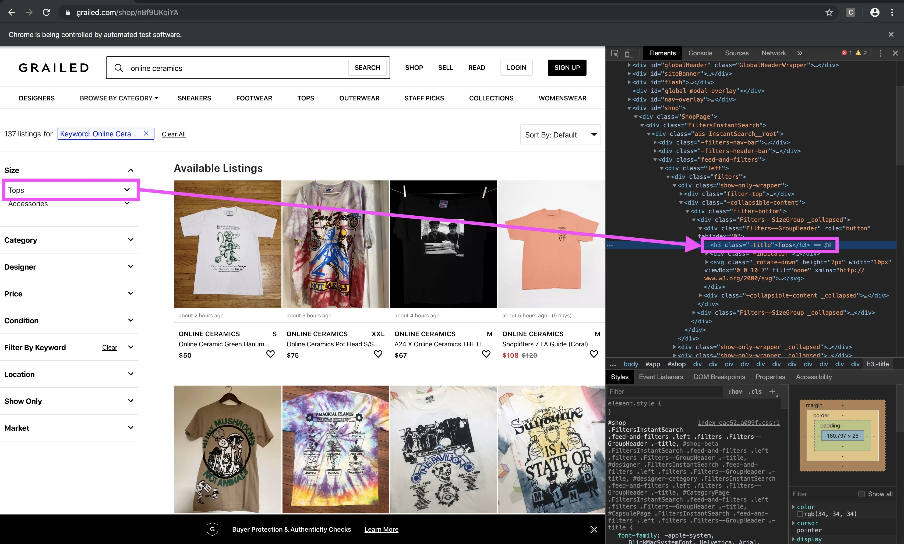
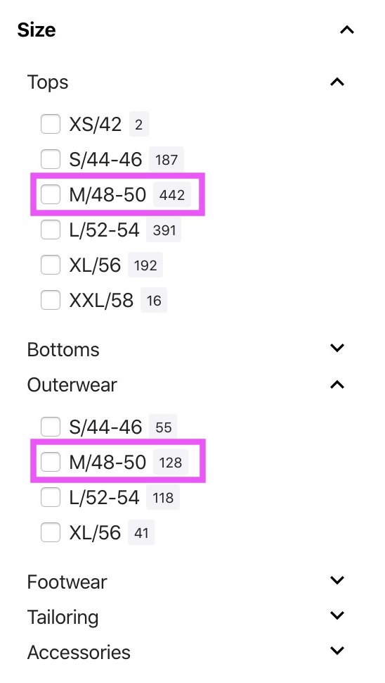
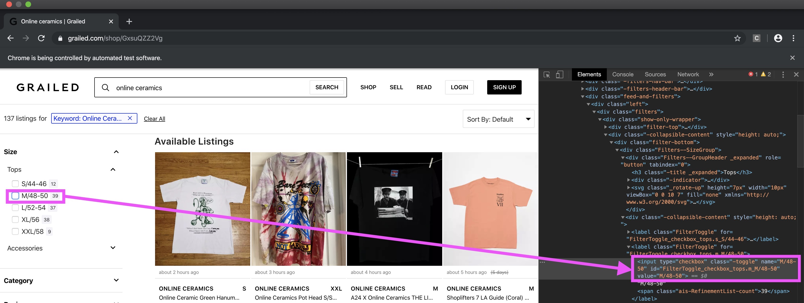
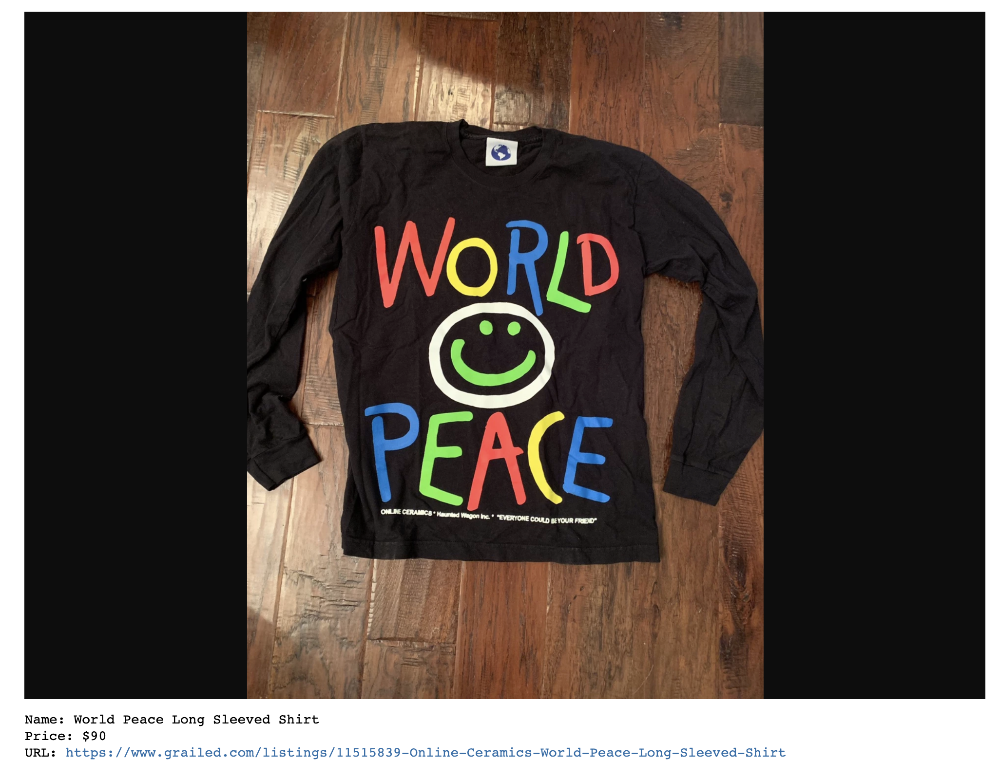

# Selenium Web Scraper - Grailed.com

### About Grailed.com:

Grailed is an online community driven marketplace where individuals can buy and sell clothes. Sellers can upload images and descriptions of their items whereas buyers can select which brand or designer they want to browse through.

### About Selenium

Selenium is a headless browser, which means it enables users to mock human-browsing behavior. Text can be entered in search boxes, buttons can be clicked, and new tabs can be created. It's super fun! More information can be found in the following: [Selenium docs](http://selenium-python.readthedocs.io/getting-started.html), [locating elements](http://selenium-python.readthedocs.io/locating-elements.html#locating-elements), and [FAQs](http://selenium-python.readthedocs.io/faq.html).

### Objective:

Personally, I spend a bit too much time on grailed. I am also a bit lazy, so I wanted to create a webscraper that will automatically return the brand, name, picture, size, and price of clothes that I like!

I have created 2 functions.
1. `grailed_scraper()` scrapes and filters items from grailed.com and returns the scraped information in a dataframe
2. `photo_download_displayer()` downloads each item's picture and displays each item's picture, price, and name in the Jupyter Notebook

### Function #1
The objective is to scrape and filter items from grailed.com.
The function `grailed_scraper()` receives 3 inputs.
1. `search_text` - Allows us to input whatever query into the search box. For example, I can look up the brand 'Online Ceramics' (which you will see repeatedly in this example)

I used Selenium's `.find_element_by_id()` to find and type 'Online Ceramics' into the text box. The explicit code is `driver.find_element_by_id('globalheader_search').send_keys('Online Ceramics')`. If the html tag is a valid input tag, then `send_keys()` can be used to type in whatever you want. You can then add a `.send_keys(u'\ue007')` that will press the enter key!

2. `category` - Filter for what kind of article of clothing we want, such as Tops, Bottoms, or Shoes.

I used Selenium's `.find_element_by_xpath()` to find the 'Tops' button and click on it. The explicit code is `driver.find_element_by_xpath("//h3[contains(text(), 'Tops')]").click()`. In this example, xpath looks for the html header `h3`  that contains the text 'Tops'.

3. `size` - Filter for sizes, ie small/medium/large for Tops, size 30 for Bottoms, and size 10.5 for shoes

Again, `.find_element_by_xpath()` was implemented to click on the 'Medium' sizes which are denoted as 'M/48-50'. The xpath finds the html input tag and ensures that its attributes match with what I am looking for, which in this case is `type`, `name`, and `value`. The explicit code is `driver.find_element_by_xpath(f"//input[@type='checkbox' and @name = 'M/48-50' and @value = 'M/48-50']").click()`.

After taking in 3 inputs, the `grailed_scraper()` function will open up a separate chrome driver, fill in the search box, click on the categories and the sizes, scrape all of the necessary information of each item, such as its name, price, url, picture url, and posting date, and then neatly return a dataframe with the information.

### Function #2

The objective of `photo_downloader_displayer()` is to download each item's picture and display each item's picture, price, name and URL in the Jupyter Notebook!

The function `photo_downloader_displayer()` receives 2 inputs.
1. `folder_name` - This name is quite self-explanatory. The function will create a folder with the folder name and store all of the downloaded photos in the folder.

2. `df` - The df is the dataframe that was created from `grailed_scraper()`

After taking in 2 inputs, the `photo_downloader_displayer()` function will open up a separate chrome driver using each individual item's stored URL in the dataframe. It will then grab and open up a new tab with the item's picture URL. Next, a screenshot will be taken and saved into the created folder. After downloading all of the screenshots, a for-loop will run through the dataframe and display the item's information in the notebook.

Here is a sample output after running `photo_downloader_displayer()`:

